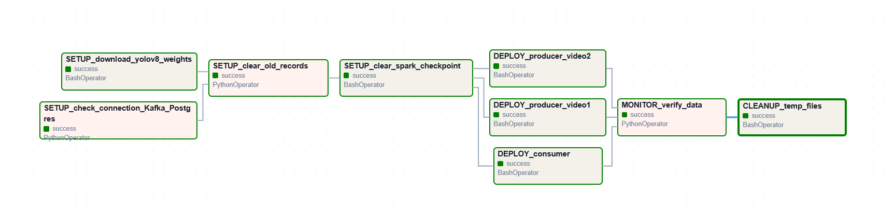
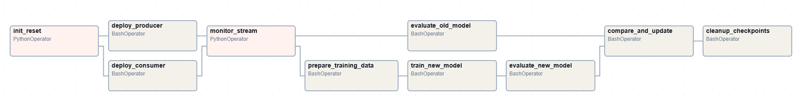
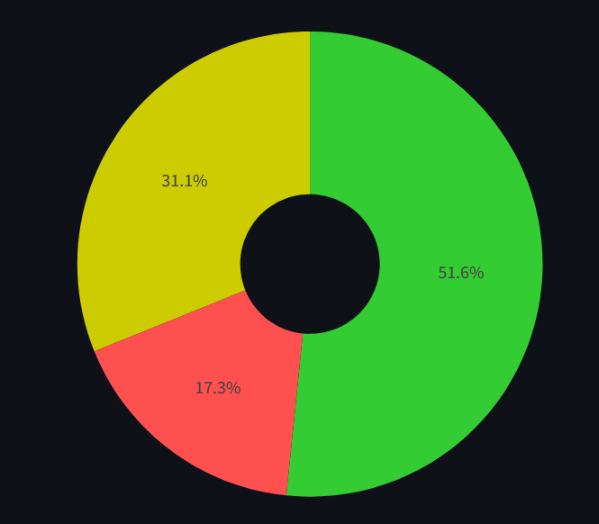

# BT 01: Vehicle Counting System



## Cấu trúc thư mục

```
airflow/
├── base/
│   ├── Dockerfile
│   └── requirements.txt
├── config/                      # Rỗng, không xóa
├── dags/
│   └── vehicle_counting_dag.py
├── logs/                        # Rỗng, tự sinh khi chạy
├── models/                      # Rỗng, yolov8n.pt tự download lúc chạy DAG
├── plugins/                     # Rỗng, không xóa
├── projects/
│   └── vehicle_counting/
│       ├── data/
│       │   ├── video1.mp4       # Thêm video 1 
│       │   └── video2.mp4       # Thêm video 2 
│       ├── scripts/
│       │   ├── consumer_spark.py
│       │   ├── producer_video1.py
│       │   ├── producer_video2.py
│       │   └── download_yolo.py
│       └── streamlit/
│           └── dashboard.py
├── docker-compose.yaml
└── README.md
```

## Lưu ý

- Tạo thư mục `projects/vehicle_counting/data/` và thêm 2 video vào thư mục:
  - `video1.mp4`
  - `video2.mp4`

## Setup

### 1. Build và khởi động Docker

```bash
cd airflow
docker-compose build
docker-compose up -d
```

### 2. Chạy Airflow & xem trang Dashboard streamlit

1. Mở: http://localhost:8080
2. Login: `admin` / `admin`
3. Tìm DAG: `vehicle_counting_system`
4. Click trigger DAG
5. Dashboard streamlit: http://localhost:8501

# BT 02: ABSA Streaming Social Listening



## Inference
1. Consumer('absa_reviews') - Kakfa topic hold first 100 records in test.csv


2. Consumer with hot-reload for new model


